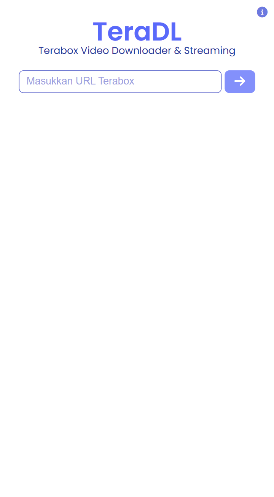
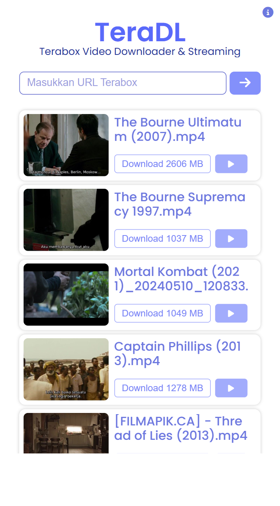
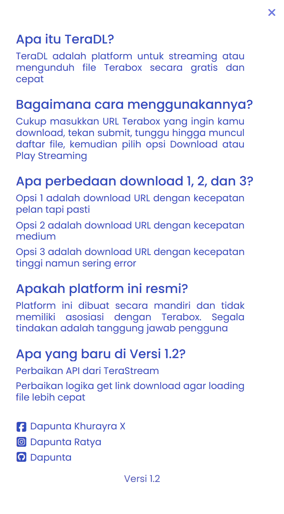

## TeraDL - Terabox Video Downloader & Streaming

<b>TeraDL</b> adalah platform untuk streaming atau mengunduh file Terabox secara gratis dan cepat, yang diciptakan agar pengguna tidak perlu menginstall aplikasi Terabox terlebih dahulu, tapi hanya dengan memasukkan url, kemudian file siap diunduh

### Informasi

<table style="border-collapse: collapse;">
    <tr>
        <td style="border: 1px solid transparent; line-height:1.3; padding: 0px;">Version</td>
        <td style="border: 1px solid transparent; line-height:1.3; padding: 0px;">1.2</td>
    </tr>
    <tr>
        <td style="border: 1px solid transparent; line-height:1.3; padding: 0px;">Website</td>
        <td style="border: 1px solid transparent; line-height:1.3; padding: 0px;"><a href="https://teradl.dapuntaratya.com">TeraDL</a></td>
    </tr>
    <tr>
        <td style="border: 1px solid transparent; line-height:1.3; padding: 0px;">API</td>
        <td style="border: 1px solid transparent; line-height:1.3; padding: 0px;"><a href="https://teradl-api.dapuntaratya.com">TeraDL API</a></td>
    </tr>
    <tr>
        <td style="border: 1px solid transparent; line-height:1.3; padding: 0px;">Author</td>
        <td style="border: 1px solid transparent; line-height:1.3; padding: 0px;"><a href="https://www.facebook.com/Dapunta.Khurayra.X">Dapunta Khurayra X</a></td>
    </tr>
    <tr>
        <td style="border: 1px solid transparent; line-height:1.3; padding: 0px;">Status</td>
        <td style="border: 1px solid transparent; line-height:1.3; padding: 0px;">Open Source (Full)</td>
    </tr>
</table>

### Screenshot

<table style="border-collapse: collapse; width: 100%; max-width: 800px; table-layout: fixed;">
    <tr>
        <td style="border: 1px solid transparent; padding: 5px; text-align: center;">
            
        </td>
        <td style="border: 1px solid transparent; padding: 5px; text-align: center;">
            
        </td>
        <td style="border: 1px solid transparent; padding: 5px; text-align: center;">
            
        </td>
    </tr>
</table>

### TechStack

<table style="border-collapse: collapse;">
    <tr>
        <td style="border: 1px solid transparent; line-height:1.3; padding: 0px;">Backend</td>
        <td style="border: 1px solid transparent; line-height:1.3; padding: 0px;">Python (Flask)</td>
    </tr>
    <tr>
        <td style="border: 1px solid transparent; line-height:1.3; padding: 0px;">Frontend</td>
        <td style="border: 1px solid transparent; line-height:1.3; padding: 0px;">HTML, CSS (VanillaCSS), Javascript (VanillaJS)</td>
    </tr>
</table>

### Apa Yang Baru Di Versi 1.2?

- [TeraDL](https://teradl.dapuntaratya.com/) adalah project lanjutan dari [TeraStream](https://terastream.dapuntaratya.com/)
- Perbaikan `get file` yang sebelumnya error
- Perubahan logika pemrograman untuk `get file` dan `get link` sehingga proses loading lebih cepat
- Perubahan tampilan menjadi lebih sederhana dan agar terkesan lebih menarik